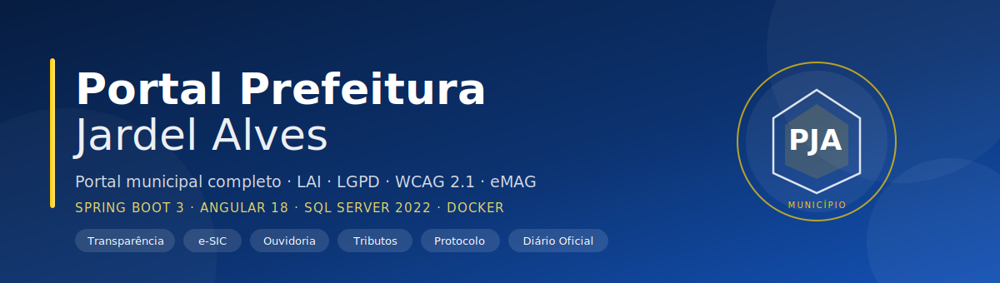
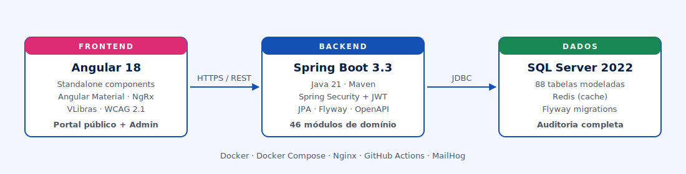
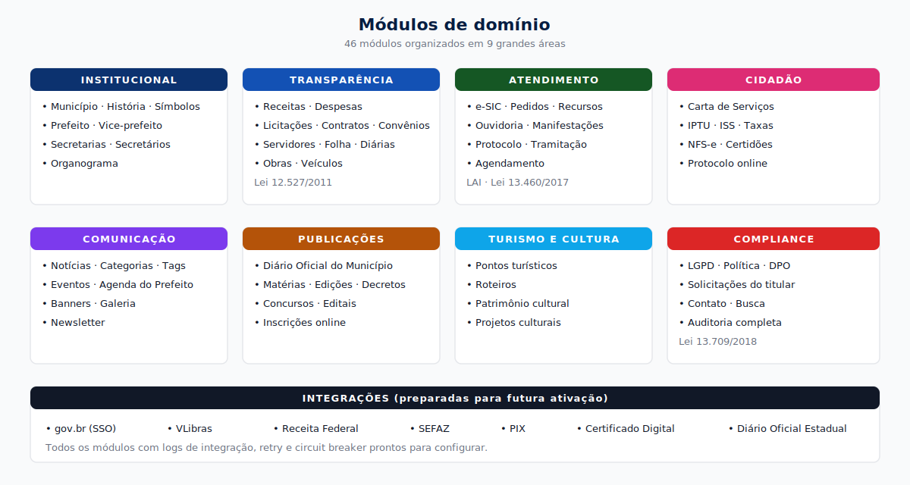

<p align="center">
  
</p>

<p align="center">
  
  
  
  
  
  
  
  
</p>

# Portal Prefeitura Jardel Alves

Monorepo do portal municipal com backend Spring Boot e frontend Angular.

> "Prefeitura Jardel Alves" e um nome ficticio utilizado apenas para fins de
> demonstracao. Todo direito autoral e de uso pertence ao autor (ver [LICENSE](LICENSE)).

## Estado atual

- Backend com Spring Boot 3.3, Java 21, seguranca basica, CORS, tratamento global de erros e endpoint `GET /api/status`.
- Frontend com scaffold Angular standalone e tela inicial responsiva.
- Modulos de dominio ainda estao como esqueletos e devem ser implementados por prioridade funcional.

## Stack

<p align="center">
  
</p>

## Modulos do dominio

<p align="center">
  
</p>

## Conformidade legal

| Exigencia                                  | Base legal                 |
|--------------------------------------------|----------------------------|
| Lei de Acesso a Informacao (e-SIC)         | Lei 12.527/2011            |
| Carta de Servicos ao Cidadao               | Lei 13.460/2017            |
| Marco Civil da Internet                    | Lei 12.965/2014            |
| LGPD                                       | Lei 13.709/2018            |
| Acessibilidade WCAG 2.1 / eMAG             | Decreto 9.094/2017         |
| Lei Brasileira de Inclusao (VLibras)       | Lei 13.146/2015            |

## Backend

Pre-requisitos:

- Java 21
- Maven 3.9+
- SQL Server e Redis para o perfil `dev`

Com banco local:

```bash
cd backend
mvn spring-boot:run
```

Sem banco, apenas para validar os endpoints basicos:

```bash
cd backend
mvn spring-boot:run -Dspring-boot.run.profiles=local
```

Endpoints iniciais:

- `GET http://localhost:8080/api/status`
- `GET http://localhost:8080/api/actuator/health`
- `GET http://localhost:8080/api/swagger-ui.html`

## Frontend

Pre-requisitos:

- Node.js 20+
- npm

```bash
cd frontend
npm install
npm start
```

A aplicacao abre em `http://localhost:4200`.

## Banco de dados

A modelagem completa esta em [`docs/database/schema-completo.sql`](docs/database/schema-completo.sql):

- 88 tabelas cobrindo todos os modulos
- Seeds iniciais (papeis, categorias, configuracoes)
- Indices em FKs e colunas de busca
- Auditoria e logs de integracao separados

```bash
sqlcmd -S localhost -U sa -P SuaSenha -i docs/database/schema-completo.sql
```

## Docker

```bash
cp .env.example .env
docker compose up -d
```

Servicos expostos:

- Backend: http://localhost:8080
- Frontend: http://localhost
- MailHog (dev): http://localhost:8025
- SQL Server: localhost:1433
- Redis: localhost:6379

## Estrutura

```
projeto-prefeitura/
├── backend/         Aplicacao Spring Boot
├── frontend/        Aplicacao Angular
├── docs/            Documentacao, ADRs, diagramas, schema SQL
├── docker/          Dockerfiles e configs
├── scripts/         Scripts de build/deploy/seed
└── .github/         CI/CD
```

## Proximas prioridades tecnicas

1. Implementar entidades, repositories, services e controllers por modulo de negocio.
2. Criar migracoes Flyway antes de ativar CRUD real.
3. Conectar os componentes Angular aos endpoints conforme os modulos forem estabilizados.

## Licenca e direitos autorais

Copyright © 2026 **Jardel Vieira Alves** ([@jardelva96](https://github.com/jardelva96)). Todos os direitos reservados.

Este projeto e distribuido sob [Licenca Proprietaria](LICENSE). O codigo-fonte
esta publico apenas para fins de demonstracao e avaliacao tecnica.

**Nao e permitido**, sem autorizacao previa e por escrito do autor:

- Uso comercial ou em producao do Software
- Copia, modificacao, redistribuicao ou sublicenciamento
- Criacao de trabalhos derivados

Para licenciamento comercial, implantacao em producao ou parceria:

- GitHub: [github.com/jardelva96](https://github.com/jardelva96)
- E-mail: jardel.va96@gmail.com

## Contato

- **Autor**: Jardel Vieira Alves
- **GitHub**: [@jardelva96](https://github.com/jardelva96)
- **Repositorio**: [portal-prefeitura-jardel-alves](https://github.com/jardelva96/portal-prefeitura-jardel-alves)
